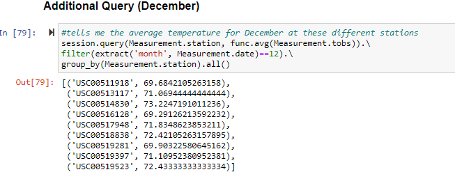

# Surfs Up using SQLite

## Overview of the Project/Purpose
SQL can come in different forms; in this week's module, we explore SQLite. Using SQLite,
the challenge aims to use queries to get information about temperature trends before launching
a surf shop. The goal is to address the temperatures in the months of June and December in order
to determine if the surf and ice-cream shop will be sustainable year-round.

---
## Summary: Analysis
We were originally provided a starter code & the expectation to complete the rest. The starter code
began with importing our dependencies. Using sqlalchemy, `create_engine` brings in the file and
`automap_base()` and `Base.prepare` allow the data to be reflected in an existing database. `Session`
creates the link from Python to the database. Next, we query the using `session.query` to determine
and answer the asks noted above.

## Summary: Additional Queries
The challenge called for additional code to be written in order to supplement the data. 
In the challenge we looked at the summary statistics for the given month's temperature. 
As such, I wanted to look further into these average temperatures and determine what the average
temperature in a given month for different stations. The following reflects the query used:
> #tells me the average temperature for June at these different stations 
session.query(Measurement.station, func.avg(Measurement.tobs)).\
filter(extract('month', Measurement.date)==6).\
group_by(Measurement.station).all()

> #tells me the average temperature for December at these different stations 
session.query(Measurement.station, func.avg(Measurement.tobs)).\
filter(extract('month', Measurement.date)==12).\
group_by(Measurement.station).all()

## Summary: Results
After running the entirety of the code, these were the results generated:  

- In order to pull the statistics for June, the `describe` function is used on the dataframe. Here we can see that in June, 
for about 1,700 records, the highest temperature reaches as high as 85 degrees and never goes below 64 degrees. Temperatures in
June seem to fall primarily in the 70s and the average temperature in June is 74.94 degrees. 

- Using the same methodology and logic, we apply the same code to the month of December. Based on the December results, we can
see that temperatures can hit as high as 83 degrees in December and go as low as 56 degrees. That is definitely a wider range than  June. However, if
we look at the average temperature in December, it seems to also stay in the 70s. While the average temperature of 71.04 is a few degrees lower than
the average temperature in June, it's also important to consider the standard deviation. Here, we see the standard deviations are the same between
the two months (roughly 3-4 degrees), meaning they share similar levels of temperatures and this wider range in December could be allocated to
some temperature being outliers.  

- When comparing the two months, I would say, they share more similarities rather than differences. I would say in December the temperature gets fairly
low as the minimum temperature hit is 56 vs 64. But when you look at the averages of both, you see that they are around the same temperature. At a closer look,
the 56 degrees actually falls outside of the 3SD range, indication of an outlier. Hence, I felt that the additional queries help provide more insight
into which stations remain fairly the same throughout the year and which station has more fluctuation. 
 
 
In June, we see that all the stations remain in temperatures of 70 degree ranges. However, when we shift to December, we see that at least 3 stations fall
below 70 degrees while the rest tend to stay in the low 70s. I think when looking at sustainability across the year, these three stations should be kept
in mind as they tend to be a bit colder in the winter months. USC00511918, USC00516128, and USC00519281 are stations that could possibly throw off the
data and would need some extra attention.

---
### Conclusion
Overall, the ask was to determine if the temperatures were sustainable year-round. My short answer is yes. The average temperature doesn't fluctuate much
from the summer to winter. However, as a precaution, I think it's important to keep stations and locations in mind as the project launches forward 
and to determine how to allocate resources.  
